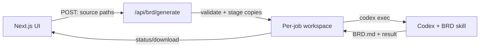

# Build BRD from Files

Turn mixed discovery material into a traceable Business Requirements Document (BRD) with Codex.

`build-brd-from-files` reads a list of local files, recovers usable content from common formats, flags questionable extraction, and produces an evidence-grounded BRD with requirements, use cases, risks, and a traceability matrix.

> Designed for analyst-led work. The skill never treats unreadable, garbled, or unverified OCR text as reliable evidence.

## What it supports

- Word, PowerPoint, Excel, OpenDocument, PDF, image/scan, CSV, JSON, HTML, text, and selected legacy Office files.
- Character-encoding recovery and an extraction manifest with `good`, `review`, and `failed` quality states.
- OCR when Tesseract is available; OCR output requires visual verification before it is used as evidence.
- A Markdown BRD and, on request, a visually verified Word version.
- A safe pattern for invoking the skill from a Windows-local Next.js UI.

## Contents

- [Install the skill](#install-the-skill)
- [Use it in Codex](#use-it-in-codex)
- [Connect a local Windows UI](#connect-a-local-windows-ui)
- [Security rules](#security-rules)
- [Troubleshooting](#troubleshooting)

## Install the skill

### 1. Clone this repository

```powershell
git clone https://github.com/akashiitd/BRD_Skill_Codex.git
cd BRD_Skill_Codex
```

### 2. Copy the skill to your personal Codex skills folder

```powershell
$codexHome = if ($env:CODEX_HOME) { $env:CODEX_HOME } else { Join-Path $HOME ".codex" }
$skillsDir = Join-Path $codexHome "skills"

New-Item -ItemType Directory -Force -Path $skillsDir | Out-Null
Copy-Item -Recurse -Force .\build-brd-from-files (Join-Path $skillsDir "build-brd-from-files")
```

### 3. Start Codex and sign in

Run `codex` from PowerShell. On the first run, complete the sign-in flow. Start a new Codex task after installing the skill so it can be discovered.

For Codex CLI installation and authentication, see the [official Codex CLI guide](https://developers.openai.com/codex/cli/).

## Use it in Codex

Give Codex absolute file paths and state the desired output format.

```text
Use $build-brd-from-files to create a traceable BRD from these source files:
C:\BRD\input\stakeholder-interviews.docx
C:\BRD\input\current-process.xlsx
C:\BRD\input\workshop-notes.pdf

Save the canonical Markdown BRD in C:\BRD\outputs\BRD.md.
List unreadable or ambiguous evidence under Open Questions; do not infer priorities.
```

For scan-heavy material:

```text
Use $build-brd-from-files on these files:
C:\BRD\input\whiteboard.jpg
C:\BRD\input\legacy-requirements.pdf

Use OCR if available. Visually verify relevant OCR findings before including them in the BRD. Save the BRD and extraction manifest in C:\BRD\outputs\.
```

The complete reusable workflow is in [build-brd-from-files/SKILL.md](build-brd-from-files/SKILL.md).

## Connect a local Windows UI

Use the Codex CLI as the local execution engine. Do **not** attempt to automate the desktop-app window.



`codex exec` is the stable non-interactive command for scripts and pipelines. It accepts a workspace root, machine-readable JSONL output, and a final-message output file. [Read the official command reference](https://developers.openai.com/codex/cli/reference/).

### Step 1: Install the prerequisites on the Windows machine

- Run the Next.js server and Codex CLI under the **same Windows user**.
- Install this skill using the steps above.
- Confirm Codex is on the server process `PATH`:

  ```powershell
  where.exe codex
  codex --version
  ```

- Run `codex` once and complete sign-in before starting the UI.

### Step 2: Configure safe local folders

Create a restricted source folder and a separate job-output folder:

```text
C:\BRD\approved-inputs\     # Files the UI may submit
C:\BRD\jobs\                # Per-job copies, logs, and generated BRDs
```

Set these in the Next.js app's `.env.local` file. Do not commit this file.

```dotenv
BRD_SOURCE_ROOT=C:\BRD\approved-inputs
BRD_JOBS_ROOT=C:\BRD\jobs
# Optional when `codex` is not already on PATH:
# CODEX_BIN=C:\path\to\codex.exe
```

### Step 3: Add the server route

Copy [examples/nextjs-app-router-route.ts](examples/nextjs-app-router-route.ts) to this location in a Next.js App Router project:

```text
app/api/brd/generate/route.ts
```

The route accepts this JSON body:

```json
{
  "paths": [
    "C:\\BRD\\approved-inputs\\interview.docx",
    "C:\\BRD\\approved-inputs\\workshop.pdf"
  ]
}
```

It validates each path, resolves symlinks, copies approved files into a unique job directory, writes a source manifest for traceability, and invokes Codex without a shell. The BRD is always requested at `outputs/BRD.md` inside that job directory.

### Step 4: Call the route from the UI

```ts
const response = await fetch("/api/brd/generate", {
  method: "POST",
  headers: { "content-type": "application/json" },
  body: JSON.stringify({ paths: selectedPaths }),
});

const result = await response.json();
if (!response.ok) throw new Error(result.error ?? "BRD generation failed");

console.log(result.jobId, result.brdPath, result.finalMessage);
```

For a production-quality experience, return a job ID immediately, stream or poll job status, and expose a separate authenticated download route for the generated BRD.

### Step 5: Test Codex without the UI first

This separates Codex setup from Next.js integration problems.

```powershell
$job = "C:\BRD\jobs\manual-test"
New-Item -ItemType Directory -Force -Path "$job\input", "$job\outputs" | Out-Null
Copy-Item "C:\BRD\approved-inputs\interview.docx" "$job\input\"

$prompt = @'
Use $build-brd-from-files to create a traceable BRD from every file in the input directory.
Save the canonical Markdown BRD exactly at outputs/BRD.md.
Do not modify source files. Flag unclear evidence for stakeholder validation.
'@

codex exec --cd $job --sandbox workspace-write --skip-git-repo-check `
  --output-last-message "$job\final-message.txt" $prompt
```

If this succeeds, the UI route can run the same workflow.

## Security rules

- Keep the UI server local to the Windows machine hosting Codex. A browser cannot itself safely read arbitrary `C:\...` paths; the server process does that work.
- Allow only files under `BRD_SOURCE_ROOT`. Reject all other paths, including paths that escape through a symbolic link.
- Copy inputs into a job workspace; do not give Codex broad access to a user's entire drive.
- Invoke `codex` with an argument array and `shell: false`. Never concatenate a user path into a shell command.
- Use `--sandbox workspace-write`; do not use `--yolo` or `--dangerously-bypass-approvals-and-sandbox` for this workflow. The CLI documentation recommends `workspace-write` for unattended local work. [Official safety guidance](https://developers.openai.com/codex/cli/reference/)
- Protect the generate and download endpoints with your normal local authentication if more than one person can reach the UI.

## Troubleshooting

| Symptom | Likely cause | What to check |
|---|---|---|
| `POST /api/brd/generate` returns `500` | The backend cannot start or complete Codex | Check the Next.js server terminal, then run `where.exe codex`, `codex --version`, and `codex` under the same Windows account. |
| `codex` is not recognized | Codex CLI is not installed or missing from `PATH` | Install Codex, reopen the terminal, and set `CODEX_BIN` if necessary. |
| Skill is not found | The skill was copied to the wrong user profile or Codex has not refreshed | Recopy it to `%USERPROFILE%\.codex\skills\build-brd-from-files` and start a new Codex task. |
| File access is denied | Submitted path is outside the approved source root | Move the file under `BRD_SOURCE_ROOT`; do not relax the root check. |
| `BRD.md` is missing | Codex could not complete the task or output location was changed | Inspect the job's `final-message.txt` and server logs; keep the output path fixed in the prompt. |

## When to use the OpenAI API instead

This repository's UI example is for a **local, single-machine workflow** that uses the signed-in Codex CLI and local file paths. For a hosted or multi-user product, use a server-side OpenAI API integration with file uploads instead; a user's local Windows path is not meaningful to a cloud service.
